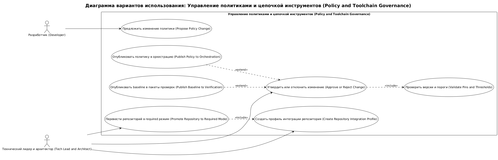
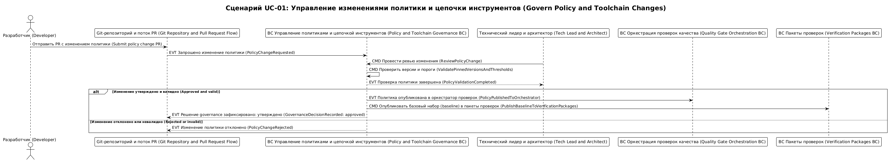
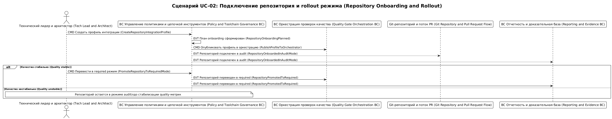

# Карта процесса домена policy-and-toolchain-governance

## 0. Контекст документа
- **Проект / продукт:** RRDCS
- **Домен:** `policy-and-toolchain-governance`
- **Источник домена:** `docs/requirements/домены/policy-and-toolchain-governance.md`
- **Дата сессии:** 2026-04-03
- **Нотация:** EVT / CMD / POL / ACTOR / EXT

## 1. Глоссарий
- **EVT:** изменение policy/toolchain зафиксировано и опубликовано.
- **CMD:** инициирование и применение изменения policy/pins.
- **POL:** правило обязательности checks и совместимости версий.
- **correlationId:** `policy_change_id`.
- **causationId:** `pr_id`.

## 2. Участники и контексты
### 2.1 Actors
- **Технический лидер и архитектор (Tech Lead and Architect):** владелец policy-изменений.
- **Разработчик (Developer):** предлагает изменения через PR.

### 2.2 BC внутри домена
- **BC Управление политиками и цепочкой инструментов (Policy and Toolchain Governance BC):** управление `QualityPolicy`, `ToolchainPin`, `GovernanceDecision`.

### 2.3 Внешние системы (EXT)
- **Quality Gate Orchestration:** получает required checks и пороги.
- **Verification Packages:** получает baseline-параметры.
- **Git-репозиторий и поток PR (Git Repository and Pull Request Flow):** канал versioned изменений policy.
- **Reporting and Evidence:** получает события onboarding и rollout-режима репозитория.

## 3. Связь с требованиями
- FR-005, FR-011, FR-012
- NFR-004, NFR-005, NFR-007, NFR-009

## 4. Список юзкейсов
- **UC-PG-01:** Изменение и выпуск quality policy и toolchain pins.
- **UC-PG-02:** Подключение нового репозитория через профиль интеграции (Repository Integration Profile).

## 5. UC-PG-01: Изменение и выпуск quality policy и toolchain pins
**Цель:** безопасно эволюционировать policy и версии toolchain без потери воспроизводимости.  
**Триггер:** PR с изменением policy/manifest/toolchain-конфигурации.  
**Результат:** опубликована новая версия policy и pin-настроек с решением governance.  
**Предусловия:** policy хранится в versioned артефактах репозитория.  
**Постусловия:** оркестрация и check-пакеты используют новую policy после approval.

### 5.1 Lanes
- **ACTOR:** Технический лидер и архитектор (Tech Lead and Architect), Разработчик (Developer)
- **BC:** BC Управление политиками и цепочкой инструментов (Policy and Toolchain Governance BC)
- **EXT:** Git-репозиторий и поток PR (Git Repository and Pull Request Flow), Quality Gate Orchestration, Verification Packages

### 5.2 Основная последовательность (Happy Path)
1. Разработчик (Developer) -> **(CMD) ProposePolicyChangeInPR** -> Git-репозиторий и поток PR (Git Repository and Pull Request Flow).
2. Git-репозиторий и поток PR (Git Repository and Pull Request Flow) -> **(EVT) PolicyChangeRequested** -> BC Управление политиками и цепочкой инструментов (Policy and Toolchain Governance BC).
3. Технический лидер и архитектор (Tech Lead and Architect) -> **(CMD) ReviewPolicyChange** -> BC Управление политиками и цепочкой инструментов (Policy and Toolchain Governance BC).
4. BC Управление политиками и цепочкой инструментов (Policy and Toolchain Governance BC) -> **(CMD) ValidatePinnedVersionsAndThresholds** -> BC Управление политиками и цепочкой инструментов (Policy and Toolchain Governance BC).
5. BC Управление политиками и цепочкой инструментов (Policy and Toolchain Governance BC) -> **(EVT) PolicyValidationCompleted**.
6. BC Управление политиками и цепочкой инструментов (Policy and Toolchain Governance BC) -> **(POL) If policy valid and approved then publish new policy version**.
7. BC Управление политиками и цепочкой инструментов (Policy and Toolchain Governance BC) -> **(CMD) PublishPolicyToOrchestrator** -> Quality Gate Orchestration.
8. BC Управление политиками и цепочкой инструментов (Policy and Toolchain Governance BC) -> **(CMD) PublishBaselineToVerificationPackages** -> Verification Packages.
9. BC Управление политиками и цепочкой инструментов (Policy and Toolchain Governance BC) -> **(EVT) GovernanceDecisionRecorded** -> Git-репозиторий и поток PR (Git Repository and Pull Request Flow).

### 5.3 Данные и идентификаторы
- **correlationId:** `policy_change_id`
- **causationId:** `pr_id`
- **Основные ID:** `policy_id`, `decision_id`, `tool_name`
- **Ключевые поля payload:**
  - `required_checks[]`: список обязательных проверок.
  - `thresholds`: пороги policy.
  - `pinned_versions`: зафиксированные версии runtime/toolchain.
  - `approved_by`: ответственный за принятие governance-решения.
  - `repository_slug`: целевой репозиторий для применения профиля.
  - `enforcement_mode`: режим внедрения (`audit|required`).

### 5.4 Инварианты и правила
- **BR-PG-01:** policy-изменение вступает в силу только после governance-approval.
- **BR-PG-02:** ключевые runtime/toolchain версии должны быть закреплены (без плавающих major).
- **BR-PG-03:** required checks публикуются в оркестратор и исполняющие пакеты как единый baseline.

### 5.5 Альтернативы / исключения
#### UC-PG-01A: Изменение отклонено governance
**Условие:** validation не пройдена или отсутствует approval.

1. BC Управление политиками и цепочкой инструментов (Policy and Toolchain Governance BC) -> **(EVT) PolicyChangeRejected**.
2. BC Управление политиками и цепочкой инструментов (Policy and Toolchain Governance BC) -> **(CMD) ReturnChangeForRevision** -> Git-репозиторий и поток PR (Git Repository and Pull Request Flow).

## 6. UC-PG-02: Подключение нового репозитория через профиль интеграции
**Цель:** подключить репозиторий к RRDCS без изменения core scripts.  
**Триггер:** заявка на onboarding нового репозитория.  
**Результат:** для репозитория создан и применен `Repository Integration Profile`.  
**Предусловия:** доступен reusable workflow и базовая policy-версия.  
**Постусловия:** репозиторий работает в `audit` и готов к переходу в `required`.

### 6.1 Основная последовательность
1. Технический лидер и архитектор (Tech Lead and Architect) -> **(CMD) CreateRepositoryIntegrationProfile** -> BC Управление политиками и цепочкой инструментов (Policy and Toolchain Governance BC).
2. BC Управление политиками и цепочкой инструментов (Policy and Toolchain Governance BC) -> **(EVT) RepositoryOnboardingPlanned**.
3. BC Управление политиками и цепочкой инструментов (Policy and Toolchain Governance BC) -> **(CMD) PublishProfileToOrchestrator** -> Quality Gate Orchestration.
4. BC Управление политиками и цепочкой инструментов (Policy and Toolchain Governance BC) -> **(EVT) RepositoryOnboardedInAuditMode** -> Git-репозиторий и поток PR (Git Repository and Pull Request Flow), Reporting and Evidence.
5. После стабилизации quality-метрик: Технический лидер и архитектор (Tech Lead and Architect) -> **(CMD) PromoteRepositoryToRequiredMode** -> BC Управление политиками и цепочкой инструментов (Policy and Toolchain Governance BC).
6. BC Управление политиками и цепочкой инструментов (Policy and Toolchain Governance BC) -> **(EVT) RepositoryPromotedToRequired** -> Quality Gate Orchestration, Reporting and Evidence.

## 7. Выделенные агрегаты
### 7.1 Реестр агрегатов

| ID | Агрегат | Root Entity | Связанные сущности | Источник (UC/EVT) | Инварианты |
|---|---|---|---|---|---|
| AGG-PG-001 | Quality Policy | QualityPolicy | GovernanceDecision | UC-PG-01, EVT PolicyValidationCompleted | BR-PG-01, BR-PG-03 |
| AGG-PG-002 | Toolchain Pin Set | ToolchainPin | QualityPolicy | UC-PG-01, EVT GovernanceDecisionRecorded | BR-PG-02 |

## 8. Итоги и принятые решения
- **Decision-PG-01:** policy и toolchain-pins управляются через PR и историю git.
- **Decision-PG-02:** governance публикует единый baseline одновременно в orchestration и verification.

## 10. Диаграммы сценариев

<!-- Исходный код: diagrams/policy-and-toolchain-governance-overview.plantuml -->

<!-- Исходный код: diagrams/UC-01-sequence.plantuml -->

<!-- Исходный код: diagrams/UC-02-sequence.plantuml -->

## 11. Операционный runbook
- `repository-onboarding-runbook.md` — пошаговая инструкция по подключению репозитория и переводу `audit -> required`.

