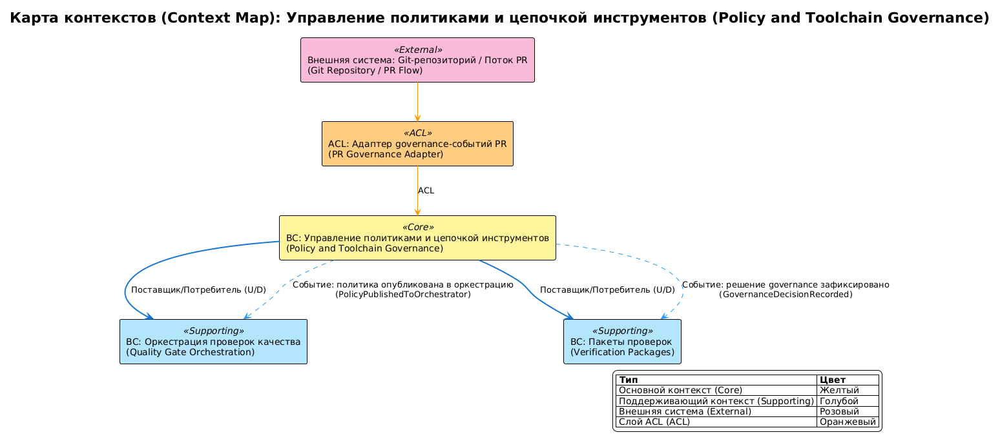

# Ограниченные контексты домена policy-and-toolchain-governance

## 0. Контекст документа
- **Проект / продукт:** RRDCS
- **Домен (domain_slug):** policy-and-toolchain-governance
- **Дата обновления:** 2026-04-03
- **Связанные документы:**
  - Domain Card: `docs/requirements/домены/policy-and-toolchain-governance.md`
  - Process Map: `docs/requirements/сценарии/policy-and-toolchain-governance/карта процесса.md`
  - Event Catalog: `docs/requirements/сценарии/policy-and-toolchain-governance/каталог мероприятий.md`

## 1. Связь домена и Bounded Context

Домен `policy-and-toolchain-governance` представлен единым Bounded Context.

**Обоснование:**
- единая ответственность: управление quality policy, required checks и pinned versions;
- единая модель governance-решений: `QualityPolicy`, `ToolchainPin`, `GovernanceDecision`;
- высокая связность правил и процесса утверждения через PR.

## 2. Список Bounded Context

### BC-01: Управление политиками и цепочкой инструментов (Policy and Toolchain Governance BC)
- **Назначение:** определение и эволюция правил качества и версий toolchain.
- **Владелец (команда):** Технический лидер и архитектор (Tech Lead and Architect).
- **Сервисы/модули:** policy-registry, governance-review-flow, toolchain-pin-manager.
- **Данные (source of truth):**
  - `QualityPolicy` (aggregate): `policy_id`, `required_checks`, `thresholds`, `effective_from`
  - `ToolchainPin` (aggregate): `tool_name`, `version`, `scope`, `update_policy`
  - `GovernanceDecision` (aggregate): `decision_id`, `change_reason`, `approved_by`, `approved_at`
  - `RepositoryIntegrationProfile` (aggregate): `repository_slug`, `profile_version`, `enforcement_mode`, `rollout_channel`
- **Основные инварианты:**
  - policy-изменение вступает в силу только после governance-approval;
  - ключевые runtime/toolchain версии закреплены без плавающих major;
  - required checks публикуются как единый baseline для orchestration и verification.
  - первый rollout репозитория выполняется на одном pilot-репозитории; расширение на `wave/global` возможно только после стабилизации pilot.
- **Публичные интерфейсы:**
  - API: `N/A` (контракт через versioned policy files и CI config)
  - Async: публикует `PolicyValidationCompleted`, `GovernanceDecisionRecorded`, `PolicyPublishedToOrchestrator`, `PolicyChangeRejected`; подписан на `PolicyChangeRequested`
- **Нефункциональные требования (NFR/SLO):**
  - NFR-004: поддерживаемость через фиксированные версии runtime/toolchain;
  - NFR-005: переносимость через CI-agnostic scripts;
  - NFR-007: расширяемость набора checks;
  - NFR-009: простота onboarding нового репозитория.

## 3. Context Map (взаимоотношения контекстов)
- **BC Управление политиками и цепочкой инструментов (Policy and Toolchain Governance BC) -> BC Оркестрация проверок качества (Quality Gate Orchestration BC):** Customer/Supplier (U/D) — поставляет required checks и policy thresholds.
- **BC Управление политиками и цепочкой инструментов (Policy and Toolchain Governance BC) -> BC Пакеты проверок (Verification Packages BC):** Customer/Supplier (U/D) — поставляет baseline и pinned versions.
- **BC Управление политиками и цепочкой инструментов (Policy and Toolchain Governance BC) <- Git-репозиторий и поток PR (Git Repository and Pull Request Flow):** Customer/Supplier (D/U) — принимает policy change requests.

### 3.1 Anti-Corruption Layer (ACL)
- **Где:** между `BC Управление политиками и цепочкой инструментов (Policy and Toolchain Governance BC)` и `Git-репозиторий и поток PR (Git Repository and Pull Request Flow)`.
- **Зачем:** отделить доменные сущности governance от технических атрибутов PR-процесса.
- **Артефакты:** PR-to-policy mapper, approval adapter.

## 4. Integration Matrix (Publish / Subscribe)

| Публикатор (BC) | Событие | Подписчики (BC) | Канал | Гарантии доставки | Ключ упорядочивания (Ordering key) | Примечания |
|---|---|---|---|---|---|---|
| Git-репозиторий и поток PR (Git Repository and Pull Request Flow) | PolicyChangeRequested | BC Управление политиками и цепочкой инструментов (Policy and Toolchain Governance BC) | PR event | at-least-once | policyChangeId | Инициирование governance |
| BC Управление политиками и цепочкой инструментов (Policy and Toolchain Governance BC) | PolicyValidationCompleted | Технический лидер и архитектор (Tech Lead and Architect) | governance event | at-least-once | policyId | Результат проверки policy |
| BC Управление политиками и цепочкой инструментов (Policy and Toolchain Governance BC) | GovernanceDecisionRecorded | Git-репозиторий и поток PR (Git Repository and Pull Request Flow), BC Оркестрация проверок качества (Quality Gate Orchestration BC), BC Пакеты проверок (Verification Packages BC) | governance event | at-least-once | policyChangeId | Ключевое решение |
| BC Управление политиками и цепочкой инструментов (Policy and Toolchain Governance BC) | PolicyPublishedToOrchestrator | BC Оркестрация проверок качества (Quality Gate Orchestration BC) | config/event | at-least-once | policyId | Обновление required checks |
| BC Управление политиками и цепочкой инструментов (Policy and Toolchain Governance BC) | PolicyChangeRejected | Разработчик (Developer), Git-репозиторий и поток PR (Git Repository and Pull Request Flow) | governance event | at-least-once | policyChangeId | Отказ в изменении |
| BC Управление политиками и цепочкой инструментов (Policy and Toolchain Governance BC) | RepositoryOnboardingPlanned | BC Оркестрация проверок качества (Quality Gate Orchestration BC) | governance event | at-least-once | repositorySlug | План onboarding |
| BC Управление политиками и цепочкой инструментов (Policy and Toolchain Governance BC) | RepositoryPromotedToRequired | BC Оркестрация проверок качества (Quality Gate Orchestration BC), BC Отчетность и доказательная база (Reporting and Evidence BC) | governance event | at-least-once | repositorySlug | Переход в блокирующий режим |

## 5. Контракты интеграции (ссылки и правила)
- **Schema registry / AsyncAPI / JSON Schema:** не определено источниками; формализация в этапе [8].
- **Версионирование событий:** `eventVersion` в envelope.
- **Backwards compatibility:** изменения policy payload с сохранением обратной совместимости.
- **Idempotency:** ключ `eventId`.
- **DLQ / retry policy:** retry доставки governance-событий до 3 попыток.

## 6. Команды и синхронные вызовы

### 6.2 Команды (CMD) на границах
| Команда (Command) | От кого | Кому (BC) | Валидирует | Порождает события | Примечания |
|---|---|---|---|---|---|
| ProposePolicyChangeInPR | Разработчик (Developer) | BC Управление политиками и цепочкой инструментов (Policy and Toolchain Governance BC) | формат policy change | PolicyChangeRequested | вход в governance |
| CreateRepositoryIntegrationProfile | Технический лидер и архитектор (Tech Lead and Architect) | BC Управление политиками и цепочкой инструментов (Policy and Toolchain Governance BC) | полнота профиля интеграции | RepositoryOnboardingPlanned | onboarding нового репозитория |
| ValidatePinnedVersionsAndThresholds | BC Управление политиками и цепочкой инструментов (Policy and Toolchain Governance BC) | BC Управление политиками и цепочкой инструментов (Policy and Toolchain Governance BC) | совместимость policy/toolchain | PolicyValidationCompleted | валидация перед решением |
| PublishPolicyToOrchestrator | BC Управление политиками и цепочкой инструментов (Policy and Toolchain Governance BC) | BC Оркестрация проверок качества (Quality Gate Orchestration BC) | полнота required checks | PolicyPublishedToOrchestrator | обновление orchestration |
| PublishProfileToOrchestrator | BC Управление политиками и цепочкой инструментов (Policy and Toolchain Governance BC) | BC Оркестрация проверок качества (Quality Gate Orchestration BC) | полнота repository profile | RepositoryOnboardedInAuditMode | onboarding профиля |
| PublishBaselineToVerificationPackages | BC Управление политиками и цепочкой инструментов (Policy and Toolchain Governance BC) | BC Пакеты проверок (Verification Packages BC) | совместимость baseline | GovernanceDecisionRecorded | обновление check-пакетов |
| PromoteRepositoryToRequiredMode | Технический лидер и архитектор (Tech Lead and Architect) | BC Управление политиками и цепочкой инструментов (Policy and Toolchain Governance BC) | готовность перехода в required | RepositoryPromotedToRequired | переход `audit -> required` |

## 7. Владение данными и согласованность
- **Модель согласованности:** strong внутри governance-решения, eventual для распространения policy в другие BC.
- **Источник истинности:**
  - `QualityPolicy` -> BC Управление политиками и цепочкой инструментов (Policy and Toolchain Governance BC)
  - `ToolchainPin` -> BC Управление политиками и цепочкой инструментов (Policy and Toolchain Governance BC)
  - `GovernanceDecision` -> BC Управление политиками и цепочкой инструментов (Policy and Toolchain Governance BC)

## 8. Риски и ограничения
- **R-01:** слишком частые policy-изменения могут дестабилизировать CI -> release cadence и обязательный governance-review.
- **R-02:** несогласованное применение policy в downstream BC -> единое событие публикации и валидация версии policy в consumers.

## 9. Parking Lot (вопросы)
- [ ] Уточнить SLA публикации policy-изменений в downstream BC для релизного цикла.

## 10. Диаграмма Context Map

<!-- Исходный код: diagrams/context-map.plantuml -->

