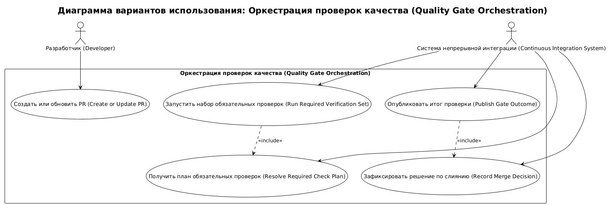
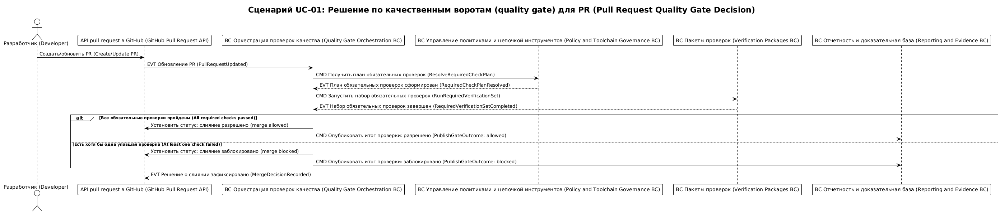

# Карта процесса домена quality-gate-orchestration

## 0. Контекст документа
- **Проект / продукт:** RRDCS
- **Домен:** `quality-gate-orchestration`
- **Источник домена:** `docs/requirements/домены/quality-gate-orchestration.md`
- **Дата сессии:** 2026-04-03
- **Нотация:** EVT / CMD / POL / ACTOR / EXT

## 1. Глоссарий
- **EVT:** зафиксированный факт выполнения шага.
- **CMD:** команда на изменение состояния.
- **POL:** правило принятия решения.
- **correlationId:** `pr_id`.
- **causationId:** `trigger_event_id`.

## 2. Участники и контексты
### 2.1 Actors
- **Разработчик (Developer):** инициирует изменение и PR.
- **Система непрерывной интеграции (Continuous Integration System):** запускает и ведет gate-orchestration.

### 2.2 BC внутри домена
- **BC Оркестрация проверок качества (Quality Gate Orchestration BC):** формирование плана проверок, запуск, агрегирование результатов, merge-decision.

### 2.3 Внешние системы (EXT)
- **API pull request в GitHub (GitHub Pull Request API):** источник событий `pull_request`.
- **Policy and Toolchain Governance:** источник `required checks` и pinned versions.
- **Verification Packages:** исполнитель style/security/platform checks.
- **Reporting and Evidence:** публикация summary и логов.

## 3. Связь с требованиями
- FR-001, FR-002, FR-003, FR-004, FR-010
- NFR-001, NFR-005

## 4. Список юзкейсов
- **UC-QGO-01:** Контроль допуска PR по обязательным checks.

## 5. UC-QGO-01: Контроль допуска PR по обязательным checks
**Цель:** разрешить merge только при прохождении всех required checks.  
**Триггер:** событие `pull_request` (open/synchronize/reopen).  
**Результат:** PR получает итог `allowed` или `blocked` с причиной.  
**Предусловия:** quality policy и check-plan доступны в versioned артефактах.  
**Постусловия:** зафиксирован `MergeDecision`, отправлен итог в отчетность.

### 5.1 Lanes
- **ACTOR:** Разработчик (Developer), Система непрерывной интеграции (Continuous Integration System)
- **BC:** BC Оркестрация проверок качества (Quality Gate Orchestration BC)
- **EXT:** API pull request в GitHub (GitHub Pull Request API), Policy and Toolchain Governance, Verification Packages, Reporting and Evidence

### 5.2 Основная последовательность (Happy Path)
1. Разработчик (Developer) -> **(CMD) CreateOrUpdatePullRequest** -> API pull request в GitHub (GitHub Pull Request API).
2. API pull request в GitHub (GitHub Pull Request API) -> **(EVT) PullRequestUpdated** -> BC Оркестрация проверок качества (Quality Gate Orchestration BC).
3. BC Оркестрация проверок качества (Quality Gate Orchestration BC) -> **(CMD) ResolveRequiredCheckPlan** -> Policy and Toolchain Governance.
4. Policy and Toolchain Governance -> **(EVT) RequiredCheckPlanResolved** -> BC Оркестрация проверок качества (Quality Gate Orchestration BC).
5. BC Оркестрация проверок качества (Quality Gate Orchestration BC) -> **(CMD) RunRequiredVerificationSet** -> Verification Packages.
6. Verification Packages -> **(EVT) RequiredVerificationSetCompleted** -> BC Оркестрация проверок качества (Quality Gate Orchestration BC).
7. BC Оркестрация проверок качества (Quality Gate Orchestration BC) -> **(POL) If all required checks passed then allow merge else block merge**.
8. BC Оркестрация проверок качества (Quality Gate Orchestration BC) -> **(CMD) PublishGateOutcome** -> Reporting and Evidence.
9. BC Оркестрация проверок качества (Quality Gate Orchestration BC) -> **(EVT) MergeDecisionRecorded** -> API pull request в GitHub (GitHub Pull Request API).

### 5.3 Данные и идентификаторы
- **correlationId:** `pr_id`
- **causationId:** `trigger_event_id`
- **Основные ID:** `execution_id`, `plan_id`, `run_id`
- **Ключевые поля payload:**
  - `required_checks[]`: обязательные проверки для текущего PR.
  - `checks_result_summary`: статус по каждому check.
  - `decision`: `allowed|blocked`.
  - `reason`: причина блокировки, если `blocked`.

### 5.4 Инварианты и правила
- **BR-QGO-01:** merge запрещен, если хотя бы один required check = `failed`.
- **BR-QGO-02:** итоговое решение всегда фиксируется в `MergeDecision`.
- **BR-QGO-03:** локальный `check-all` должен быть паритетен core PR checks.

### 5.5 Альтернативы / исключения
#### UC-QGO-01A: Падение обязательной проверки
**Условие:** хотя бы один check вернул `failed`.

1. Verification Packages -> **(EVT) RequiredCheckFailed** -> BC Оркестрация проверок качества (Quality Gate Orchestration BC).
2. BC Оркестрация проверок качества (Quality Gate Orchestration BC) -> **(CMD) SetMergeBlockedStatus** -> API pull request в GitHub (GitHub Pull Request API).
3. BC Оркестрация проверок качества (Quality Gate Orchestration BC) -> **(CMD) PublishFailureEvidence** -> Reporting and Evidence.

## 7. Выделенные агрегаты
### 7.1 Реестр агрегатов

| ID | Агрегат | Root Entity | Связанные сущности | Источник (UC/EVT) | Инварианты |
|---|---|---|---|---|---|
| AGG-QGO-001 | Gate Execution | GateExecution | CheckPlan, GateResult | UC-QGO-01, EVT PullRequestUpdated | BR-QGO-01 |
| AGG-QGO-002 | Merge Decision | MergeDecision | GateExecution | UC-QGO-01, EVT MergeDecisionRecorded | BR-QGO-02 |

## 8. Итоги и принятые решения
- **Decision-QGO-01:** orchestration работает как единый gate-контур для local pre-check и PR.
- **Decision-QGO-02:** источник обязательности checks находится вне домена, в Policy and Toolchain Governance.

## 10. Диаграммы сценариев

<!-- Исходный код: diagrams/quality-gate-orchestration-overview.plantuml -->

<!-- Исходный код: diagrams/UC-01-sequence.plantuml -->

