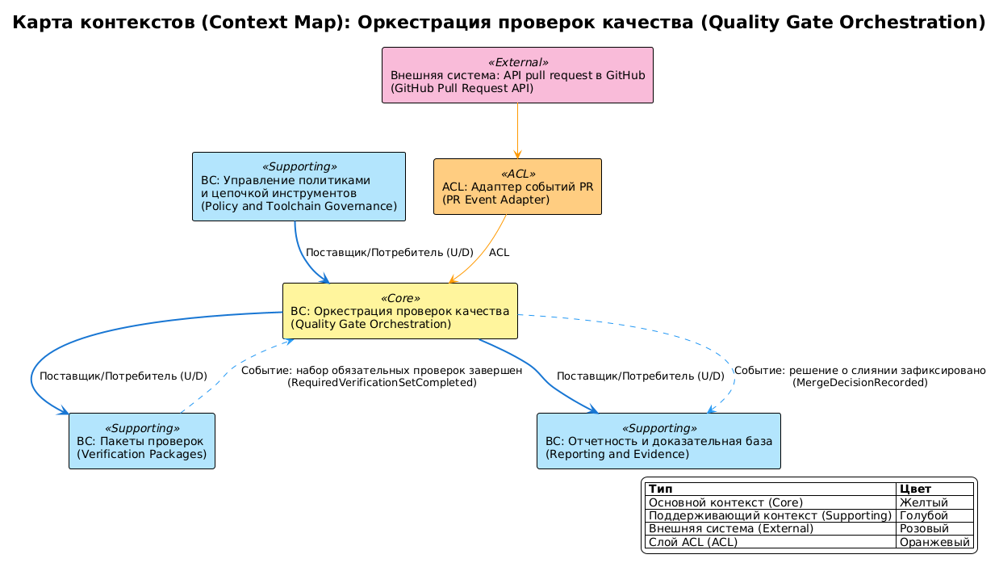

# Ограниченные контексты домена quality-gate-orchestration

## 0. Контекст документа
- **Проект / продукт:** RRDCS
- **Домен (domain_slug):** quality-gate-orchestration
- **Дата обновления:** 2026-04-03
- **Связанные документы:**
  - Domain Card: `docs/requirements/домены/quality-gate-orchestration.md`
  - Process Map: `docs/requirements/сценарии/quality-gate-orchestration/карта процесса.md`
  - Event Catalog: `docs/requirements/сценарии/quality-gate-orchestration/каталог мероприятий.md`

## 1. Связь домена и Bounded Context

Домен `quality-gate-orchestration` представлен единым Bounded Context.

**Обоснование:**
- единая ответственность: оркестрация required checks и merge-decision;
- единая модель данных: `GateExecution`, `MergeDecision`, `CheckPlan`;
- функции тесно связаны и исполняются в рамках одного orchestration-потока.

## 2. Список Bounded Context

### BC-01: BC Оркестрация проверок качества (Quality Gate Orchestration BC)
- **Назначение:** запуск обязательных проверок, агрегация их статусов, фиксация решения о merge.
- **Владелец (команда):** Platform Engineering.
- **Сервисы/модули:** workflow-orchestrator, check-plan-resolver, merge-decision-engine.
- **Данные (source of truth):**
  - `GateExecution` (aggregate): `execution_id`, `trigger_type`, `started_at`, `completed_at`, `final_status`
  - `MergeDecision` (aggregate): `pr_id`, `required_checks_passed`, `decision`, `reason`
  - `CheckPlan` (aggregate): `plan_id`, `required_checks`, `optional_checks`, `matrix_profile`
- **Основные инварианты:**
  - merge запрещен, если хотя бы один required check = `failed`;
  - для каждого PR-run фиксируется единственное итоговое решение;
  - execution не может завершиться без полного набора required check-статусов.
  - для каждого репозитория применяется его `enforcement_mode` (`audit` или `required`).
- **Публичные интерфейсы:**
  - API: `N/A` (контракт реализуется через CI workflow и policy/config файлы)
  - Async: публикует `MergeDecisionRecorded`; подписан на `PullRequestUpdated`, `RequiredCheckPlanResolved`, `RequiredVerificationSetCompleted`, `RequiredCheckFailed`
- **Нефункциональные требования (NFR/SLO):**
  - NFR-001: допуск в main только через required checks;
  - NFR-005: orchestration-логика CI-agnostic на уровне scripts.

## 3. Context Map (взаимоотношения контекстов)
- **BC Оркестрация проверок качества (Quality Gate Orchestration BC) -> BC Управление политиками и цепочкой инструментов (Policy and Toolchain Governance BC):** Customer/Supplier (D/U) — получает required checks и pinned versions.
- **BC Оркестрация проверок качества (Quality Gate Orchestration BC) -> BC Пакеты проверок (Verification Packages BC):** Customer/Supplier (D/U) — инициирует запуск baseline checks.
- **BC Оркестрация проверок качества (Quality Gate Orchestration BC) -> BC Отчетность и доказательная база (Reporting and Evidence BC):** Customer/Supplier (U/D) — передает итоговые статусы и причины блокировки.
- **BC Оркестрация проверок качества (Quality Gate Orchestration BC) <- API pull request в GitHub (GitHub Pull Request API):** Conformist (CF) — принимает модель PR-событий без трансляции.

### 3.1 Anti-Corruption Layer (ACL)
- **Где:** между `BC Оркестрация проверок качества (Quality Gate Orchestration BC)` и `API pull request в GitHub (GitHub Pull Request API)`.
- **Зачем:** изолировать доменную модель решения о merge от формата внешних webhook/check-событий.
- **Артефакты:** event mappers, status adapters.

## 4. Integration Matrix (Publish / Subscribe)

| Publisher (BC) | Event | Subscribers (BC) | Канал | Гарантии доставки | Ordering key | Примечания |
|---|---|---|---|---|---|---|
| API pull request в GitHub (GitHub Pull Request API) | PullRequestUpdated | BC Оркестрация проверок качества (Quality Gate Orchestration BC) | GitHub webhook/event | at-least-once | prId | Триггер orchestration |
| BC Управление политиками и цепочкой инструментов (Policy and Toolchain Governance BC) | RequiredCheckPlanResolved | BC Оркестрация проверок качества (Quality Gate Orchestration BC) | CI config read/event | at-least-once | planId | required checks для run |
| BC Пакеты проверок (Verification Packages BC) | RequiredVerificationSetCompleted | BC Оркестрация проверок качества (Quality Gate Orchestration BC) | CI artifact/event | at-least-once | runId | Итог check-пакетов |
| BC Оркестрация проверок качества (Quality Gate Orchestration BC) | MergeDecisionRecorded | API pull request в GitHub (GitHub Pull Request API), BC Отчетность и доказательная база (Reporting and Evidence BC) | status/event | at-least-once | prId | Финальное решение |
| BC Пакеты проверок (Verification Packages BC) | RequiredCheckFailed | BC Оркестрация проверок качества (Quality Gate Orchestration BC), BC Отчетность и доказательная база (Reporting and Evidence BC) | event | at-least-once | runId | Негативный сценарий |

## 5. Контракты интеграции (ссылки и правила)
- **Schema registry / AsyncAPI / JSON Schema:** не определено источниками; фиксируется на этапе [8].
- **Версионирование событий:** `eventVersion` в envelope, старт с версии `1`.
- **Backwards compatibility:** новые поля добавляются обратно-совместимо; удаление/переименование требует новой major-версии события.
- **Idempotency:** ключ `eventId` для дедупликации.
- **DLQ / retry policy:** retry публикации до 3 попыток, затем fail-log и ручной разбор.

## 6. Команды и синхронные вызовы

### 6.2 Команды (CMD) на границах
| Command | От кого | К кому (BC) | Валидирует | Порождает события | Notes |
|---|---|---|---|---|---|
| ResolveRequiredCheckPlan | BC Оркестрация проверок качества (Quality Gate Orchestration BC) | BC Управление политиками и цепочкой инструментов (Policy and Toolchain Governance BC) | доступность policy и required checks | RequiredCheckPlanResolved | синхронная конфигурационная зависимость |
| RunRequiredVerificationSet | BC Оркестрация проверок качества (Quality Gate Orchestration BC) | BC Пакеты проверок (Verification Packages BC) | полнота required checks | RequiredVerificationSetCompleted / RequiredCheckFailed | старт baseline |
| PublishGateOutcome | BC Оркестрация проверок качества (Quality Gate Orchestration BC) | BC Отчетность и доказательная база (Reporting and Evidence BC) | консистентность decision и run-status | MergeDecisionRecorded | публикация итогов |

## 7. Владение данными и согласованность
- **Модель согласованности:** strong внутри `MergeDecision`, eventual для междоменной публикации статусов.
- **Источник истинности:**
  - `GateExecution` -> BC Оркестрация проверок качества (Quality Gate Orchestration BC)
  - `MergeDecision` -> BC Оркестрация проверок качества (Quality Gate Orchestration BC)
  - `CheckPlan` -> BC Оркестрация проверок качества (Quality Gate Orchestration BC) (исполняемая копия), исходная policy в BC Управление политиками и цепочкой инструментов (Policy and Toolchain Governance BC)

## 8. Риски и ограничения
- **R-01:** неполный статус required checks может привести к ложному решению -> блокирующая проверка полноты check-plan перед decision.
- **R-02:** изменение формата событий GitHub может нарушить обработку -> поддержка ACL-адаптеров и контрактных тестов.

## 9. Parking Lot (вопросы)
- [ ] Зафиксировать единый формат schema/contract артефактов (JSON Schema или AsyncAPI) на этапе [8].

## 10. Диаграмма Context Map

<!-- Исходный код: diagrams/context-map.plantuml -->

