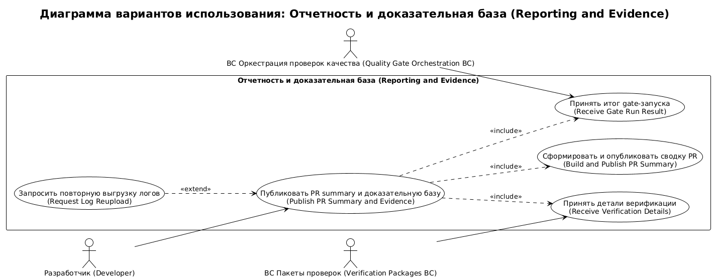
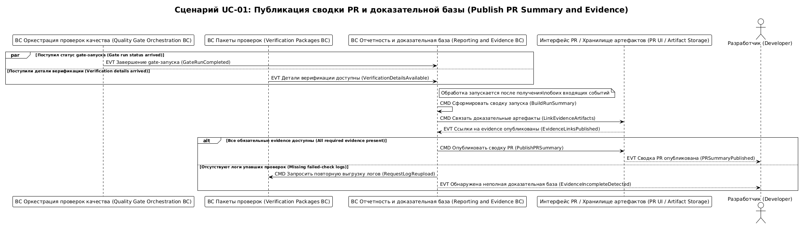

# Карта процесса домена reporting-and-evidence

## 0. Контекст документа
- **Проект / продукт:** RRDCS
- **Домен:** `reporting-and-evidence`
- **Источник домена:** `docs/requirements/домены/reporting-and-evidence.md`
- **Дата сессии:** 2026-04-03
- **Нотация:** EVT / CMD / POL / ACTOR / EXT

## 1. Глоссарий
- **EVT:** фиксация результата check-run или публикации отчета.
- **CMD:** формирование summary/links/report.
- **POL:** правило полноты и читаемости evidence.
- **correlationId:** `run_id`.
- **causationId:** `execution_id`.

## 2. Участники и контексты
### 2.1 Actors
- **BC Оркестрация проверок качества (Quality Gate Orchestration BC):** поставляет итог gate-запуска.
- **BC Пакеты проверок (Verification Packages BC):** поставляет детали верификации и логи.
- **Разработчик (Developer):** анализирует причины падений.

### 2.2 BC внутри домена
- **BC Отчетность и доказательная база (Reporting and Evidence BC):** сбор статусов, формирование PR summary, хранение ссылок на evidence.

### 2.3 Внешние системы (EXT)
- **Quality Gate Orchestration:** источник итогового статуса gate-run.
- **Verification Packages:** источник детальных результатов и логов.
- **GitHub Интерфейс PR / хранилище артефактов (PR UI / Artifact Storage):** канал публикации отчетности.
- **Система непрерывной интеграции (Continuous Integration System):** среда исполнения pipeline и доставки артефактов; в UC-RE-01 не моделируется отдельным actor.
- **Технический лидер и архитектор (Tech Lead and Architect):** потребитель итоговой отчетности вне шага публикации UC-RE-01.

## 3. Связь с требованиями
- FR-008
- NFR-002, NFR-006

## 4. Список юзкейсов
- **UC-RE-01:** Публикация PR summary и доказательной базы.

## 5. UC-RE-01: Публикация PR summary и доказательной базы
**Цель:** обеспечить наблюдаемость и проверяемость результата required checks для каждого PR.  
**Триггер:** завершение run в Quality Gate Orchestration.  
**Результат:** в PR доступен summary с причинами fail и ссылками на логи/артефакты.  
**Предусловия:** получены итоговый gate-status и детальные check-results.  
**Постусловия:** сформирован `RunSummary`, связаны `EvidenceLink`, опубликован итог `PRSummaryPublished`.

### 5.1 Lanes
- **ACTOR:** BC Оркестрация проверок качества (Quality Gate Orchestration BC), BC Пакеты проверок (Verification Packages BC), Разработчик (Developer)
- **BC:** BC Отчетность и доказательная база (Reporting and Evidence BC)
- **EXT:** Quality Gate Orchestration, Verification Packages, GitHub Интерфейс PR / хранилище артефактов (PR UI / Artifact Storage)

### 5.2 Основная последовательность (Happy Path)
1. Quality Gate Orchestration -> **(EVT) GateRunCompleted** -> BC Отчетность и доказательная база (Reporting and Evidence BC).
2. Verification Packages -> **(EVT) VerificationDetailsAvailable** -> BC Отчетность и доказательная база (Reporting and Evidence BC).
3. BC Отчетность и доказательная база (Reporting and Evidence BC) -> **(CMD) BuildRunSummary** -> BC Отчетность и доказательная база (Reporting and Evidence BC).
4. BC Отчетность и доказательная база (Reporting and Evidence BC) -> **(CMD) LinkEvidenceArtifacts** -> GitHub Интерфейс PR / хранилище артефактов (PR UI / Artifact Storage).
5. BC Отчетность и доказательная база (Reporting and Evidence BC) -> **(EVT) EvidenceLinksPublished**.
6. BC Отчетность и доказательная база (Reporting and Evidence BC) -> **(POL) If failed checks exist then include reason and failed step reference for each check**.
7. BC Отчетность и доказательная база (Reporting and Evidence BC) -> **(CMD) PublishPRSummary** -> GitHub Интерфейс PR / хранилище артефактов (PR UI / Artifact Storage).
8. GitHub Интерфейс PR / хранилище артефактов (PR UI / Artifact Storage) -> **(EVT) PRSummaryPublished** -> Разработчик (Developer).

### 5.3 Данные и идентификаторы
- **correlationId:** `run_id`
- **causationId:** `execution_id`
- **Основные ID:** `pr_id`, `artifact_id`, `report_id`
- **Ключевые поля payload:**
  - `overall_status`: итог run (`passed|failed`).
  - `failed_checks[]`: перечень упавших checks.
  - `reason_by_check`: причина падения по каждому check.
  - `artifact_urls[]`: ссылки на логи/артефакты.
  - `repository_slug`: репозиторий, к которому относится run.

### 5.4 Инварианты и правила
- **BR-RE-01:** для каждого failed check обязательно публикуется причина и ссылка на лог.
- **BR-RE-02:** run summary должен соответствовать итогу merge-decision.
- **BR-RE-03:** данные отчетности должны быть доступны для приемки и аудита.

### 5.5 Альтернативы / исключения
#### UC-RE-01A: Отсутствует лог failed check
**Условие:** у failed check нет доступного `log_ref`.

1. BC Отчетность и доказательная база (Reporting and Evidence BC) -> **(EVT) EvidenceIncompleteDetected**.
2. BC Отчетность и доказательная база (Reporting and Evidence BC) -> **(CMD) MarkRunSummaryAsIncomplete** -> GitHub Интерфейс PR / хранилище артефактов (PR UI / Artifact Storage).
3. BC Отчетность и доказательная база (Reporting and Evidence BC) -> **(CMD) RequestLogReupload** -> Verification Packages.

## 7. Выделенные агрегаты
### 7.1 Реестр агрегатов

| ID | Агрегат | Root Entity | Связанные сущности | Источник (UC/EVT) | Инварианты |
|---|---|---|---|---|---|
| AGG-RE-001 | Run Reporting | RunSummary | EvidenceLink | UC-RE-01, EVT PRSummaryPublished | BR-RE-01, BR-RE-02 |
| AGG-RE-002 | Verification Reporting | VerificationReport | RunSummary | UC-RE-01, EVT PRSummaryPublished | BR-RE-03 |

## 8. Итоги и принятые решения
- **Decision-RE-01:** reporting строится как отдельный домен и не влияет на логику исполнения checks.
- **Decision-RE-02:** обязательный формат evidence: summary + ссылки на логи/артефакты по каждому failed check.

## 10. Диаграммы сценариев

<!-- Исходный код: diagrams/reporting-and-evidence-overview.plantuml -->

<!-- Исходный код: diagrams/UC-01-sequence.plantuml -->

