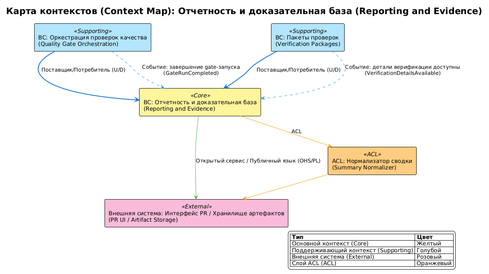

# Ограниченные контексты домена reporting-and-evidence

## 0. Контекст документа
- **Проект / продукт:** RRDCS
- **Домен (domain_slug):** reporting-and-evidence
- **Дата обновления:** 2026-04-03
- **Связанные документы:**
  - Domain Card: `docs/requirements/домены/reporting-and-evidence.md`
  - Process Map: `docs/requirements/сценарии/reporting-and-evidence/карта процесса.md`
  - Event Catalog: `docs/requirements/сценарии/reporting-and-evidence/каталог мероприятий.md`

## 1. Связь домена и Bounded Context

Домен `reporting-and-evidence` представлен единым Bounded Context.

**Обоснование:**
- единая ответственность: публикация PR summary и evidence;
- единая модель данных: `RunSummary`, `EvidenceLink`, `VerificationReport`;
- сквозной поток от получения run-status до публикации отчетности.

## 2. Список Bounded Context

### BC-01: Отчетность и доказательная база (Reporting and Evidence BC)
- **Назначение:** агрегировать результаты проверок, публиковать summary и доказательные артефакты.
- **Владелец (команда):** CI/Platform Engineering.
- **Сервисы/модули:** summary-builder, evidence-linker, verification-report-updater.
- **Данные (source of truth):**
  - `RunSummary` (aggregate): `pr_id`, `run_id`, `overall_status`, `failed_checks`
  - `EvidenceLink` (aggregate): `artifact_id`, `artifact_type`, `url`, `retention_days`
  - `VerificationReport` (aggregate): `report_id`, `period`, `tests_passed`, `deviations`
  - `RepositoryEvidenceContext` (value object): `repository_slug`, `profile_version`, `enforcement_mode`
- **Основные инварианты:**
  - для каждого failed check обязателен `reason` и `log_ref`;
  - summary должен соответствовать итоговому merge-decision;
  - evidence-ссылки должны быть доступны в пределах retention-policy.
- **Публичные интерфейсы:**
  - API: `N/A` (публикация через PR UI / artifact storage)
  - Async: публикует `EvidenceLinksPublished`, `PRSummaryPublished`, `EvidenceIncompleteDetected`; подписан на `GateRunCompleted`, `VerificationDetailsAvailable`
- **Нефункциональные требования (NFR/SLO):**
  - NFR-002: медианное время core pipeline <= 15 минут (как потребитель результата);
  - NFR-006: наблюдаемость failed checks через summary/logs.

## 3. Context Map (взаимоотношения контекстов)
- **BC Отчетность и доказательная база (Reporting and Evidence BC) <- BC Оркестрация проверок качества (Quality Gate Orchestration BC):** Customer/Supplier (D/U) — получает итоговый gate status.
- **BC Отчетность и доказательная база (Reporting and Evidence BC) <- BC Пакеты проверок (Verification Packages BC):** Customer/Supplier (D/U) — получает детальные check logs/findings.
- **BC Отчетность и доказательная база (Reporting and Evidence BC) -> Разработчик (Developer) / Tech Lead:** Open Host Service (OHS) через PR summary/artifacts.

### 3.1 Anti-Corruption Layer (ACL)
- **Где:** между `BC Отчетность и доказательная база (Reporting and Evidence BC)` и источниками результатов (`BC Оркестрация проверок качества (Quality Gate Orchestration BC)`, `BC Пакеты проверок (Verification Packages BC)`).
- **Зачем:** выровнять разные форматы статусов/логов в единый summary-модель.
- **Артефакты:** summary normalizer, evidence formatter.

## 4. Integration Matrix (Publish / Subscribe)

| Публикатор (BC) | Событие | Подписчики (BC) | Канал | Гарантии доставки | Ключ упорядочивания (Ordering key) | Примечания |
|---|---|---|---|---|---|---|
| BC Оркестрация проверок качества (Quality Gate Orchestration BC) | GateRunCompleted | BC Отчетность и доказательная база (Reporting and Evidence BC) | event | at-least-once | runId | Итог gate-run |
| BC Пакеты проверок (Verification Packages BC) | VerificationDetailsAvailable | BC Отчетность и доказательная база (Reporting and Evidence BC) | event/artifact | at-least-once | runId | Детали check-результатов |
| BC Отчетность и доказательная база (Reporting and Evidence BC) | EvidenceLinksPublished | Разработчик (Developer), Технический лидер и архитектор (Tech Lead and Architect) | PR artifacts link | at-least-once | runId | Доказательная база |
| BC Отчетность и доказательная база (Reporting and Evidence BC) | PRSummaryPublished | Разработчик (Developer), Технический лидер и архитектор (Tech Lead and Architect) | PR summary | at-least-once | prId | Читаемый итог |
| BC Отчетность и доказательная база (Reporting and Evidence BC) | EvidenceIncompleteDetected | BC Пакеты проверок (Verification Packages BC), Разработчик (Developer) | event/notification | at-least-once | runId | Недостаточность evidence |

## 5. Контракты интеграции (ссылки и правила)
- **Schema registry / AsyncAPI / JSON Schema:** не определено источниками; уточняется на этапе [8].
- **Версионирование событий:** `eventVersion` в envelope.
- **Backwards compatibility:** совместимость summary payload для потребителей PR UI.
- **Idempotency:** ключ `eventId`.
- **DLQ / retry policy:** retry публикации summary/artifacts; при исчерпании — `EvidenceIncompleteDetected`.

## 6. Команды и синхронные вызовы

### 6.2 Команды (CMD) на границах
| Команда (Command) | От кого | Кому (BC) | Валидирует | Порождает события | Примечания |
|---|---|---|---|---|---|
| BuildRunSummary | BC Отчетность и доказательная база (Reporting and Evidence BC) | BC Отчетность и доказательная база (Reporting and Evidence BC) | полнота входных статусов | PRSummaryPublished | формирование summary |
| LinkEvidenceArtifacts | BC Отчетность и доказательная база (Reporting and Evidence BC) | PR artifacts storage | доступность логов | EvidenceLinksPublished | публикация ссылок |
| RequestLogReupload | BC Отчетность и доказательная база (Reporting and Evidence BC) | BC Пакеты проверок (Verification Packages BC) | отсутствие log_ref для failed check | EvidenceIncompleteDetected | корректирующее действие |

## 7. Владение данными и согласованность
- **Модель согласованности:** eventual между поступлением результатов и итоговой публикацией summary.
- **Источник истинности:**
  - `RunSummary` -> BC Отчетность и доказательная база (Reporting and Evidence BC)
  - `EvidenceLink` -> BC Отчетность и доказательная база (Reporting and Evidence BC)
  - `VerificationReport` -> BC Отчетность и доказательная база (Reporting and Evidence BC)

## 8. Риски и ограничения
- **R-01:** неполные логи снижают доказательность -> контроль обязательности `log_ref` для failed checks.
- **R-02:** рассинхронизация статусов и summary -> валидация соответствия `overall_status` и merge-decision перед публикацией.

## 9. Parking Lot (вопросы)
- [ ] Определить целевую retention policy для evidence артефактов по классам проверок.

## 10. Диаграмма Context Map

<!-- Исходный код: diagrams/context-map.plantuml -->

