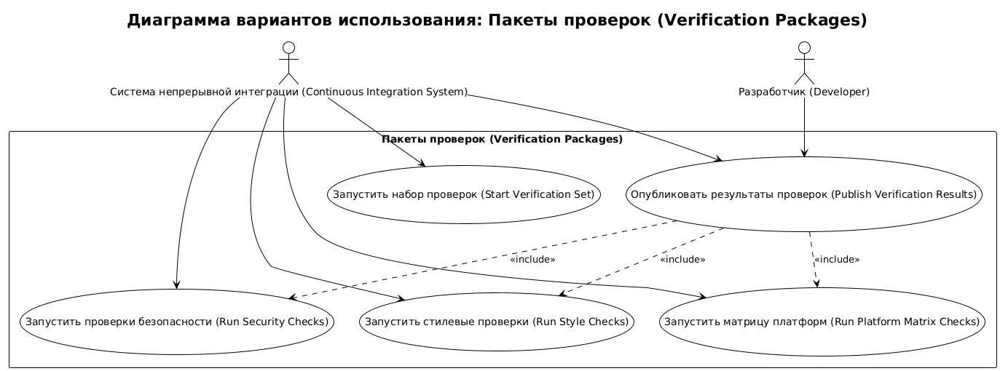
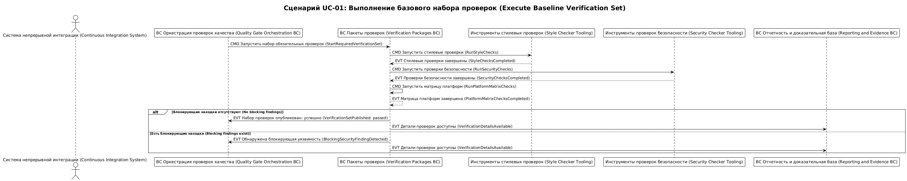

# Карта процесса домена verification-packages

## 0. Контекст документа
- **Проект / продукт:** RRDCS
- **Домен:** `verification-packages`
- **Источник домена:** `docs/requirements/домены/verification-packages.md`
- **Дата сессии:** 2026-04-03
- **Нотация:** EVT / CMD / POL / ACTOR / EXT

## 1. Глоссарий
- **EVT:** результат выполнения конкретной проверки.
- **CMD:** запуск или повторный запуск check-пакета.
- **POL:** правило интерпретации результатов baseline.
- **correlationId:** `run_id`.
- **causationId:** `execution_id`.

## 2. Участники и контексты
### 2.1 Actors
- **Система непрерывной интеграции (Continuous Integration System):** исполняет check-пакеты.
- **Разработчик (Developer):** исправляет найденные нарушения.

### 2.2 BC внутри домена
- **BC Пакеты проверок (Verification Packages BC):** запуск style/security/platform checks, нормализация результата.

### 2.3 Внешние системы (EXT)
- **Quality Gate Orchestration:** источник плана required checks.
- **Reporting and Evidence:** приемник результатов, логов и findings.

## 3. Связь с требованиями
- FR-006, FR-007, FR-009
- NFR-003, NFR-004

## 4. Список юзкейсов
- **UC-VP-01:** Выполнение baseline check-пакетов для PR.

## 5. UC-VP-01: Выполнение baseline check-пакетов для PR
**Цель:** выполнить обязательный style/security/platform baseline и выдать стандартизированный результат.  
**Триггер:** команда запуска набора checks от Quality Gate Orchestration.  
**Результат:** сформирован набор `CheckResult` и `SecurityFinding` для каждого check.  
**Предусловия:** получен план required checks и pinned versions runtime/toolchain.  
**Постусловия:** результаты и логи отправлены в Reporting and Evidence.

### 5.1 Lanes
- **ACTOR:** Система непрерывной интеграции (Continuous Integration System), Разработчик (Developer)
- **BC:** BC Пакеты проверок (Verification Packages BC)
- **EXT:** Quality Gate Orchestration, Reporting and Evidence

### 5.2 Основная последовательность (Happy Path)
1. Quality Gate Orchestration -> **(CMD) StartRequiredVerificationSet** -> BC Пакеты проверок (Verification Packages BC).
2. BC Пакеты проверок (Verification Packages BC) -> **(CMD) RunStyleChecks** -> BC Пакеты проверок (Verification Packages BC).
3. BC Пакеты проверок (Verification Packages BC) -> **(EVT) StyleChecksCompleted**.
4. BC Пакеты проверок (Verification Packages BC) -> **(CMD) RunSecurityChecks** -> BC Пакеты проверок (Verification Packages BC).
5. BC Пакеты проверок (Verification Packages BC) -> **(EVT) SecurityChecksCompleted**.
6. BC Пакеты проверок (Verification Packages BC) -> **(CMD) RunPlatformMatrixChecks** -> BC Пакеты проверок (Verification Packages BC).
7. BC Пакеты проверок (Verification Packages BC) -> **(EVT) PlatformMatrixChecksCompleted**.
8. BC Пакеты проверок (Verification Packages BC) -> **(POL) If baseline passed then mark set passed else mark set failed**.
9. BC Пакеты проверок (Verification Packages BC) -> **(CMD) PublishVerificationResults** -> Reporting and Evidence.
10. BC Пакеты проверок (Verification Packages BC) -> **(EVT) VerificationSetPublished** -> Quality Gate Orchestration.

### 5.3 Данные и идентификаторы
- **correlationId:** `run_id`
- **causationId:** `execution_id`
- **Основные ID:** `check_name`, `platform`, `finding_id`
- **Ключевые поля payload:**
  - `check_status`: `passed|failed`.
  - `duration_sec`: длительность check-run.
  - `severity`: уровень finding.
  - `log_ref`: ссылка на лог шага.

### 5.4 Инварианты и правила
- **BR-VP-01:** каждый required check должен завершиться явным статусом `passed|failed`.
- **BR-VP-02:** security findings должны иметь severity и location.
- **BR-VP-03:** platform checks выполняются минимум для Windows и Linux.

### 5.5 Альтернативы / исключения
#### UC-VP-01A: Обнаружен security finding
**Условие:** хотя бы один security check выдал finding уровня, блокирующего policy.

1. BC Пакеты проверок (Verification Packages BC) -> **(EVT) BlockingSecurityFindingDetected**.
2. BC Пакеты проверок (Verification Packages BC) -> **(CMD) MarkVerificationSetFailed** -> Quality Gate Orchestration.
3. BC Пакеты проверок (Verification Packages BC) -> **(CMD) PublishSecurityEvidence** -> Reporting and Evidence.

## 7. Выделенные агрегаты
### 7.1 Реестр агрегатов

| ID | Агрегат | Root Entity | Связанные сущности | Источник (UC/EVT) | Инварианты |
|---|---|---|---|---|---|
| AGG-VP-001 | Verification Set | CheckResult | PlatformRun | UC-VP-01, EVT PlatformMatrixChecksCompleted | BR-VP-01, BR-VP-03 |
| AGG-VP-002 | Security Findings | SecurityFinding | CheckResult | UC-VP-01, EVT BlockingSecurityFindingDetected | BR-VP-02 |

## 8. Итоги и принятые решения
- **Decision-VP-01:** baseline разбит на style/security/platform пакеты с единым форматом результата.
- **Decision-VP-02:** публикация результатов отделена от merge-decision.

## 10. Диаграммы сценариев

<!-- Исходный код: diagrams/verification-packages-overview.plantuml -->

<!-- Исходный код: diagrams/UC-01-sequence.plantuml -->

