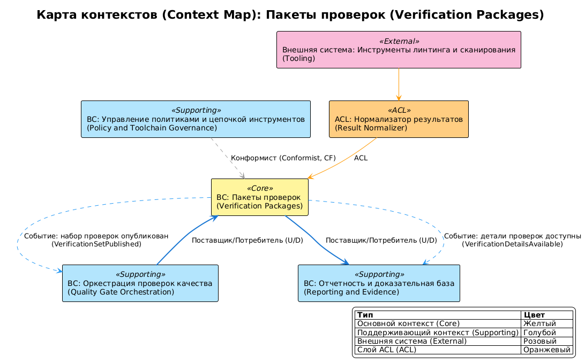

# Ограниченные контексты домена verification-packages

## 0. Контекст документа
- **Проект / продукт:** RRDCS
- **Домен (domain_slug):** verification-packages
- **Дата обновления:** 2026-04-03
- **Связанные документы:**
  - Domain Card: `docs/requirements/домены/verification-packages.md`
  - Process Map: `docs/requirements/сценарии/verification-packages/карта процесса.md`
  - Event Catalog: `docs/requirements/сценарии/verification-packages/каталог мероприятий.md`

## 1. Связь домена и Bounded Context

Домен `verification-packages` представлен единым Bounded Context.

**Обоснование:**
- единая ответственность: исполнение style/security/platform checks;
- единая модель результатов: `CheckResult`, `SecurityFinding`, `PlatformRun`;
- все проверки работают в одном операционном цикле PR-run.

## 2. Список Bounded Context

### BC-01: Пакеты проверок (Verification Packages BC)
- **Назначение:** выполнение required check-набора и формирование стандартизированных результатов.
- **Владелец (команда):** CI/Platform Engineering.
- **Сервисы/модули:** style-check-runner, security-check-runner, platform-matrix-runner, result-normalizer.
- **Данные (source of truth):**
  - `CheckResult` (aggregate): `check_name`, `status`, `duration_sec`, `error_count`
  - `SecurityFinding` (aggregate): `tool`, `severity`, `location`, `fingerprint`
  - `PlatformRun` (aggregate): `platform`, `runner`, `status`, `log_ref`
  - `RepositoryRunContext` (value object): `repository_slug`, `profile_version`
- **Основные инварианты:**
  - каждый required check должен завершиться статусом `passed|failed`;
  - blocking security findings переводят verification set в `failed`;
  - platform baseline покрывает минимум Windows и Linux.
- **Публичные интерфейсы:**
  - API: `N/A` (интерфейс через CI job contracts)
  - Async: публикует `StyleChecksCompleted`, `SecurityChecksCompleted`, `PlatformMatrixChecksCompleted`, `VerificationSetPublished`, `BlockingSecurityFindingDetected`; подписан на `StartRequiredVerificationSet`
- **Нефункциональные требования (NFR/SLO):**
  - NFR-003: security baseline для каждого PR;
  - NFR-004: pinned runtime/toolchain версии.

## 3. Context Map (взаимоотношения контекстов)
- **BC Пакеты проверок (Verification Packages BC) <- BC Оркестрация проверок качества (Quality Gate Orchestration BC):** Customer/Supplier (U/D) — принимает план required checks.
- **BC Пакеты проверок (Verification Packages BC) -> BC Отчетность и доказательная база (Reporting and Evidence BC):** Customer/Supplier (U/D) — поставляет логи и результаты.
- **BC Пакеты проверок (Verification Packages BC) <- BC Управление политиками и цепочкой инструментов (Policy and Toolchain Governance BC):** Conformist (CF) — принимает baseline policy и pinned versions.

### 3.1 Anti-Corruption Layer (ACL)
- **Где:** между `BC Пакеты проверок (Verification Packages BC)` и конкретными инструментами линтинга/сканирования.
- **Зачем:** привести разноформатные отчеты инструментов к единому `CheckResult/SecurityFinding`.
- **Артефакты:** result adapters, parser wrappers.

## 4. Integration Matrix (Publish / Subscribe)

| Публикатор (BC) | Событие | Подписчики (BC) | Канал | Гарантии доставки | Ключ упорядочивания (Ordering key) | Примечания |
|---|---|---|---|---|---|---|
| BC Оркестрация проверок качества (Quality Gate Orchestration BC) | StartRequiredVerificationSet | BC Пакеты проверок (Verification Packages BC) | CI command/event | at-least-once | runId | Запуск required set |
| BC Пакеты проверок (Verification Packages BC) | StyleChecksCompleted | BC Оркестрация проверок качества (Quality Gate Orchestration BC), BC Отчетность и доказательная база (Reporting and Evidence BC) | event/artifact | at-least-once | runId | Style/quality результат |
| BC Пакеты проверок (Verification Packages BC) | SecurityChecksCompleted | BC Оркестрация проверок качества (Quality Gate Orchestration BC), BC Отчетность и доказательная база (Reporting and Evidence BC) | event/artifact | at-least-once | runId | Security результат |
| BC Пакеты проверок (Verification Packages BC) | PlatformMatrixChecksCompleted | BC Оркестрация проверок качества (Quality Gate Orchestration BC) | event/artifact | at-least-once | runId | Платформенный результат |
| BC Пакеты проверок (Verification Packages BC) | VerificationSetPublished | BC Оркестрация проверок качества (Quality Gate Orchestration BC), BC Отчетность и доказательная база (Reporting and Evidence BC) | event | at-least-once | runId | Итоговый статус набора |
| BC Пакеты проверок (Verification Packages BC) | BlockingSecurityFindingDetected | BC Оркестрация проверок качества (Quality Gate Orchestration BC), BC Отчетность и доказательная база (Reporting and Evidence BC) | event | at-least-once | runId | Триггер блокировки merge |

## 5. Контракты интеграции (ссылки и правила)
- **Schema registry / AsyncAPI / JSON Schema:** не определено источниками; формализуется на этапе [8].
- **Версионирование событий:** `eventVersion` в envelope, старт с `1`.
- **Backwards compatibility:** поддержка старых consumers при добавлении полей payload.
- **Idempotency:** ключ `eventId`.
- **DLQ / retry policy:** retry публикации результатов; при ошибке фиксируется fail-log.

## 6. Команды и синхронные вызовы

### 6.2 Команды (CMD) на границах
| Команда (Command) | От кого | Кому (BC) | Валидирует | Порождает события | Примечания |
|---|---|---|---|---|---|
| StartRequiredVerificationSet | BC Оркестрация проверок качества (Quality Gate Orchestration BC) | BC Пакеты проверок (Verification Packages BC) | наличие required checks | StyleChecksCompleted / SecurityChecksCompleted / PlatformMatrixChecksCompleted | старт проверки |
| PublishVerificationResults | BC Пакеты проверок (Verification Packages BC) | BC Отчетность и доказательная база (Reporting and Evidence BC) | полнота логов и findings | VerificationSetPublished | публикация evidence |
| MarkVerificationSetFailed | BC Пакеты проверок (Verification Packages BC) | BC Оркестрация проверок качества (Quality Gate Orchestration BC) | blocking findings | BlockingSecurityFindingDetected | негативный путь |

## 7. Владение данными и согласованность
- **Модель согласованности:** eventual для междоменной доставки результатов; strong внутри конкретного check-run.
- **Источник истинности:**
  - `CheckResult` -> BC Пакеты проверок (Verification Packages BC)
  - `SecurityFinding` -> BC Пакеты проверок (Verification Packages BC)
  - `PlatformRun` -> BC Пакеты проверок (Verification Packages BC)

## 8. Риски и ограничения
- **R-01:** дрейф версий инструментов дает нестабильные результаты -> использовать pinned versions из governance.
- **R-02:** несовместимые форматы отчетов инструментов -> адаптеры парсинга и контрактные тесты нормализации.

## 9. Parking Lot (вопросы)
- [ ] Уточнить целевой формат хранения golden samples для контрактов событий check-результатов.

## 10. Диаграмма Context Map

<!-- Исходный код: diagrams/context-map.plantuml -->

